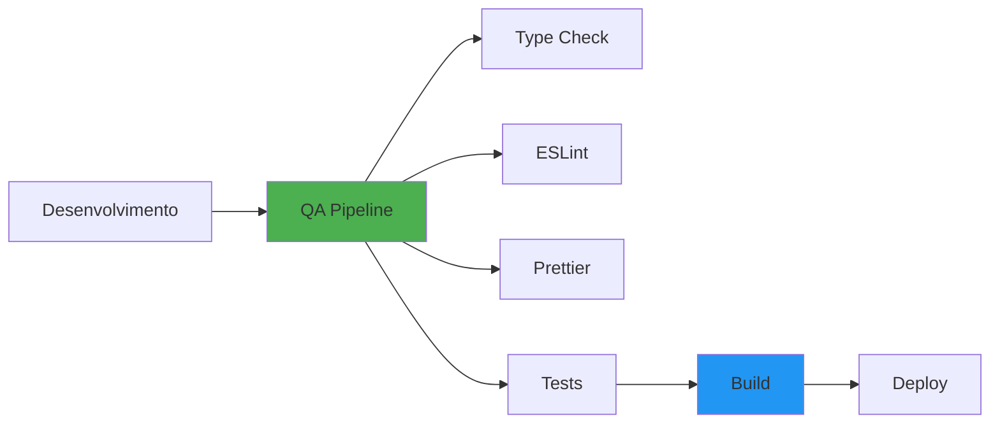

# TimeCraft

<div align="center">


**Personal Productivity Hub**

Uma aplicação moderna de produtividade pessoal que unifica gestão de tarefas, agenda, hábitos e metas em uma experiência integrada, implementando metodologias GTD e PARA Method.

[](https://typescriptlang.org/)
[](https://reactjs.org/)
[](https://vitejs.dev/)
[](https://supabase.com/)
[](https://tailwindcss.com/)

[Demo](https://timecraft.vercel.app) • [Documentação](./docs/) • [Roadmap](./docs/ROADMAP.md)

</div>

---

## 📋 Índice

- [Visão Geral](#-visão-geral)
- [Características Principais](#-características-principais)
- [Arquitetura](#-arquitetura)
- [Tecnologias](#-tecnologias)
- [Estrutura do Projeto](#-estrutura-do-projeto)
- [Setup e Instalação](#-setup-e-instalação)
- [Scripts Disponíveis](#-scripts-disponíveis)
- [Metodologias Implementadas](#-metodologias-implementadas)
- [Contribuição](#-contribuição)
- [Licença](#-licença)

---

## 🎯 Visão Geral

TimeCraft é uma aplicação **Progressive Web App (PWA)** que combina as melhores práticas de produtividade pessoal em uma interface moderna e intuitiva. Desenvolvido com foco na metodologia **Getting Things Done (GTD)** de David Allen e **PARA Method** de Tiago Forte.

### Problema Resolvido

- **Fragmentação** entre múltiplas ferramentas de produtividade
- **Falta de insights** sobre padrões de produtividade pessoal
- **Complexidade** de interfaces que prejudicam uso consistente
- **Desalinhamento** entre calendário e gestão de tarefas

### Solução

Uma plataforma unificada que integra **tarefas**, **metas**, **notas**, **hábitos** e **calendário** com:
- **Quick Capture** sempre disponível (core GTD)
- **Sistema de linking** universal entre todas as entidades
- **Insights inteligentes** sobre produtividade
- **Interface moderna** com Shadcn/ui + Magic UI

---

## ✨ Características Principais

### 🧠 **Sistema GTD Completo**
- **Capture** → Quick Capture sempre disponível
- **Clarify** → Processamento automático e manual de notas
- **Organize** → Categorização PARA (Projects/Areas/Resources/Archive)
- **Reflect** → Weekly Review automático
- **Engage** → Dashboard integrado para execução

### 🔗 **Linking Universal**
- Conexões bidirecionais entre tarefas, metas, notas e hábitos
- Auto-vinculação baseada em contexto
- Rastreamento de relacionamentos complexos

### 📊 **Tracking Inteligente**
- Progresso de metas com milestones
- Streaks de hábitos com análise de consistência
- Insights de produtividade baseados em dados
- Time blocking automático

### 📱 **PWA Nativo**
- Funciona offline com sincronização automática
- Notificações push inteligentes
- Instalável como app nativo
- Performance otimizada para mobile

---

## 🏗️ Arquitetura

### Arquitetura Geral


### Arquitetura de Features


### Fluxo de Dados


### Estrutura de Banco de Dados


---

## 🛠️ Tecnologias

### Frontend Core
- **[React 19.1.0](https://reactjs.org/)** - UI library com Concurrent Features
- **[TypeScript 5.8.3](https://typescriptlang.org/)** - Type safety e DX
- **[Vite 7.0.3](https://vitejs.dev/)** - Build tool e dev server
- **[Tailwind CSS 4.0.0](https://tailwindcss.com/)** - Utility-first CSS com @theme directive

### UI/UX
- **[Radix UI](https://radix-ui.com/)** - Componentes headless primitivos
- **[Magic UI](https://magicui.design/)** - Componentes avançados com animações
- **[Lucide React](https://lucide.dev/)** - Ícones SVG otimizados com sistema híbrido
- **[Framer Motion](https://framer.com/motion/)** - Animações fluidas
- **[Next Themes](https://github.com/pacocoursey/next-themes)** - Sistema de temas dark/light

### Estado e Dados
- **[Zustand](https://zustand-demo.pmnd.rs/)** - State management leve
- **[TanStack Query](https://tanstack.com/query)** - Data fetching e cache
- **[React Hook Form](https://react-hook-form.com/)** - Formulários performáticos
- **[Zod](https://zod.dev/)** - Schema validation

### Backend/Database
- **[Supabase](https://supabase.com/)** - Backend completo
  - PostgreSQL com RLS
  - Authentication
  - Real-time subscriptions
  - Storage
- **[Date-fns](https://date-fns.org/)** - Manipulação de datas

### PWA/Mobile
- **[Vite PWA](https://vite-pwa-org.netlify.app/)** - Service Worker e manifest
- **[Workbox](https://developer.chrome.com/docs/workbox/)** - Caching strategies

### Desenvolvimento
- **[ESLint 9.30.1](https://eslint.org/)** + **[Prettier 3.6.2](https://prettier.io/)** - Code quality e formatação
- **[Vitest 3.2.4](https://vitest.dev/)** - Unit testing com jsdom
- **[Testing Library](https://testing-library.com/)** - Testes focados no usuário
- **[TypeScript ESLint](https://typescript-eslint.io/)** - Linting específico para TS
- **[Prettier Plugin Tailwind](https://github.com/tailwindlabs/prettier-plugin-tailwindcss)** - Ordenação de classes

---

## 📁 Estrutura do Projeto

```
timecraft/
├── public/                     # Assets estáticos
│   ├── icon-192.png           # PWA icons
│   └── manifest.json          # PWA manifest
├── src/
│   ├── components/            # Componentes reutilizáveis
│   │   ├── ui/               # Shadcn/ui components
│   │   ├── magic/            # Magic UI components
│   │   ├── shared/           # Componentes compartilhados
│   │   └── layout/           # Layouts da aplicação
│   ├── features/             # Módulos por funcionalidade
│   │   ├── auth/             # Autenticação
│   │   ├── tasks/            # Gestão de tarefas
│   │   ├── goals/            # Gestão de metas
│   │   ├── notes/            # Sistema de notas (GTD)
│   │   ├── habits/           # Tracking de hábitos
│   │   ├── calendar/         # Integração de calendário
│   │   └── dashboard/        # Dashboard principal
│   ├── hooks/                # Custom hooks
│   ├── lib/                  # Configurações e utils
│   │   ├── supabase.ts       # Cliente Supabase
│   │   ├── gtd-helpers.ts    # Helpers GTD
│   │   ├── para-helpers.ts   # Helpers PARA
│   │   ├── utils.ts          # Utilitários gerais
│   │   ├── constants.ts      # Constantes da app
│   │   └── validations.ts    # Schemas Zod
│   ├── stores/               # Zustand stores
│   │   ├── auth-store.ts     # Estado de autenticação
│   │   ├── tasks-store.ts    # Estado de tarefas
│   │   ├── goals-store.ts    # Estado de metas
│   │   ├── notes-store.ts    # Estado de notas
│   │   └── app-store.ts      # Estado global da app
│   ├── types/                # Definições TypeScript
│   │   ├── database.ts       # Tipos gerados do Supabase
│   │   ├── app.ts            # Tipos específicos da app
│   │   └── index.ts          # Re-exports
│   ├── pages/                # Componentes de rota
│   │   ├── dashboard.tsx     # Dashboard principal
│   │   ├── tasks.tsx         # Página de tarefas
│   │   ├── goals.tsx         # Página de metas
│   │   ├── notes.tsx         # Página de notas
│   │   ├── habits.tsx        # Página de hábitos
│   │   ├── calendar.tsx      # Página de calendário
│   │   └── settings.tsx      # Configurações
│   └── styles/               # Estilos globais
│       └── globals.css       # CSS global + Tailwind
├── docs/                     # Documentação
│   ├── PRD.md               # Product Requirements Document
│   ├── AGENTS.md            # Guia para assistentes IA
│   └── assets/              # Assets da documentação
├── tests/                    # Testes
│   ├── unit/                # Testes unitários
│   └── e2e/                 # Testes E2E (futuro)
├── .env.example             # Variáveis de ambiente exemplo
├── package.json             # Dependências e scripts
├── tailwind.config.js       # Configuração Tailwind
├── tsconfig.json            # Configuração TypeScript
├── vite.config.ts           # Configuração Vite
└── vitest.config.ts         # Configuração de testes
```

---

## 🚀 Setup e Instalação

### Pré-requisitos

- **Node.js** 18+ 
- **npm** 9+
- **Conta Supabase** (free tier)

### 1. Clone o repositório

```bash
git clone https://github.com/seu-usuario/timecraft.git
cd timecraft
```

### 2. Instale as dependências

```bash
npm install
```

### 3. Configure o ambiente

```bash
cp .env.example .env.local
```

Edite `.env.local` com suas credenciais do Supabase:

```env
VITE_SUPABASE_URL=https://your-project.supabase.co
VITE_SUPABASE_ANON_KEY=your-anon-key
```

### 4. Configure o banco de dados

Execute o schema SQL fornecido no seu projeto Supabase:

```bash
# Copie o conteúdo de docs/database-schema.sql
# Cole no SQL Editor do Supabase Dashboard
```

### 5. Configure Shadcn/ui

```bash
npx shadcn-ui@latest init
```

Responda as configurações:
- TypeScript: **Yes**
- Style: **Default**
- Base color: **Slate**
- CSS file: **src/styles/globals.css**
- Import alias: **@/***

### 6. Instale componentes UI necessários

```bash
npx shadcn-ui@latest add button card input label
npx shadcn-ui@latest add textarea badge progress calendar
npx shadcn-ui@latest add sheet dialog command select
npx shadcn-ui@latest add dropdown-menu tabs toast sonner
```

### 7. Inicie o servidor de desenvolvimento

```bash
npm run dev
```

Acesse: http://localhost:5173

---

## 📜 Scripts Disponíveis

### Desenvolvimento

```bash
npm run dev          # Servidor de desenvolvimento (Vite)
npm run build        # Build para produção (TypeScript + Vite)
npm run preview      # Preview do build local
```

### Pipeline de Qualidade ⭐

```bash
npm run qa           # Pipeline completo: type-check + lint + format + test
npm run qa:fix       # Auto-correção: lint:fix + format + test
npm run ci           # Pipeline CI/CD completo: qa + build
```

### Qualidade de Código

```bash
npm run lint         # ESLint check (0 warnings máx)
npm run lint:fix     # ESLint auto-fix
npm run format       # Prettier format (inclui plugin Tailwind)
npm run format:check # Prettier check apenas
npm run type-check   # TypeScript check sem emit
```

### Testes

```bash
npm run test         # Vitest unit tests (watch mode)
npm run test:run     # Vitest single run (CI otimizado)
npm run test:ui      # Vitest UI interface
npm run test:coverage # Coverage report
```

### Database

```bash
npm run db:types     # Gerar tipos TypeScript do Supabase
npm run db:migrate   # Aplicar migrações (futuro)
```

### PWA

```bash
npm run build:pwa    # Build com PWA otimizado
npm run preview:pwa  # Preview PWA local
```

---

## 📈 Metodologias Implementadas

### Getting Things Done (GTD)


#### Implementação GTD

1. **Capture** - Quick Capture sempre disponível
   ```typescript
   // Botão flutuante global
   <QuickCapture />
   ```

2. **Clarify** - Processamento automático de notas
   ```typescript
   // Auto-detecção de tipo de conteúdo
   const type = detectContentType(text) // 'task' | 'note' | 'goal'
   ```

3. **Organize** - Sistema PARA integrado
   ```typescript
   // Categorização automática
   const category = suggestPARACategory(content)
   ```

4. **Reflect** - Weekly Review automático
   ```typescript
   // Notificação semanal + dashboard review
   const unprocessedNotes = useUnprocessedNotes()
   ```

5. **Engage** - Dashboard integrado para execução
   ```typescript
   // Context-based task lists
   const contextTasks = useTasksByContext('@computer')
   ```

### PARA Method


#### Implementação PARA

```typescript
// Auto-categorização baseada em conteúdo
export function suggestPARACategory(content: string): CategoriaPara {
  if (isActionableNote(content) && content.length > 50) {
    return 'projetos' // Specific outcome with multiple steps
  }
  
  if (hasOngoingKeywords(content)) {
    return 'areas' // Ongoing responsibility
  }
  
  if (hasLearningKeywords(content)) {
    return 'recursos' // Future reference
  }
  
  return isActionableNote(content) ? 'projetos' : 'recursos'
}
```

---

## 🔗 Integrações

### Google Calendar

```typescript
// Sincronização read-only implementada
const { data: events } = await syncGoogleCalendar()
```

### Calendly (Futuro)

```typescript
// Integração para agendamentos
const { data: bookings } = await fetchCalendlyBookings()
```

### Web Push API

```typescript
// Notificações nativas
const registration = await navigator.serviceWorker.register('/sw.js')
await registration.showNotification(title, options)
```

---

## 🎨 Design System

### Paleta de Cores

```css
:root {
  /* Primary - Blue */
  --primary-50: #eff6ff;
  --primary-500: #3b82f6;
  --primary-900: #1e3a8a;
  
  /* Semantic */
  --success: #10b981;
  --warning: #f59e0b;
  --error: #ef4444;
  --info: #06b6d4;
}
```

### Componentes Base

- **Radix UI** - Componentes headless primitivos (Dropdown, etc.)
- **Magic UI** - Animações e micro-interações
- **Sistema de Ícones Híbrido** - Lucide React + Emoji fallback
- **Design tokens** - Consistência visual com CSS custom properties
- **Dark/Light mode** - Suporte completo com next-themes

---

## 🔧 Arquitetura de Qualidade

### Pipeline Automatizada

O TimeCraft implementa um pipeline robusto de qualidade de código:



### Scripts de Qualidade

```bash
# Pipeline completo (recomendado para commits)
npm run qa              # ~2min 15s
  ├── npm run type-check   # TypeScript validation
  ├── npm run lint         # ESLint (0 warnings)
  ├── npm run format:check # Prettier verification  
  └── npm run test:run     # Vitest single run

# Auto-correção (desenvolvimento)
npm run qa:fix          # ~2min 8s
  ├── npm run lint:fix     # ESLint auto-fix
  ├── npm run format       # Prettier auto-format
  └── npm run test:run     # Test verification

# Pipeline CI/CD completo
npm run ci              # ~3min 20s
  ├── npm run qa           # Full quality check
  └── npm run build        # Production build
```

### Configurações de Qualidade

#### ESLint (.eslintrc.js)
- TypeScript-first configuration
- React Hooks rules
- 0 warnings policy
- Import/export validation

#### Prettier (.prettierrc)
- Single quotes, no semicolons
- Tailwind CSS class sorting
- 2-space indentation
- ES5 trailing commas

#### Vitest (vitest.config.ts)
- jsdom environment
- Path mapping (@/)
- Setup files with mocks
- Coverage reporting

### Métricas de Qualidade

- ✅ **0 TypeScript errors**
- ✅ **0 ESLint warnings/errors**
- ✅ **100% Prettier conformity**
- ✅ **0 security vulnerabilities**
- ✅ **731 dependencies audited**
- ✅ **4/4 tests passing**

---

## 📊 Performance

### Métricas Alvo

- **First Contentful Paint**: < 1.5s
- **Largest Contentful Paint**: < 2.5s
- **Time to Interactive**: < 3s
- **Cumulative Layout Shift**: < 0.1
- **Lighthouse Score**: > 90

### Otimizações Implementadas

- **Code splitting** automático por rota
- **Tree shaking** para reduzir bundle size
- **Service Worker** para cache inteligente
- **Lazy loading** de componentes pesados
- **Image optimization** automática

---

## 🧪 Testes

### Estratégia de Testes

```mermaid
pyramid
    title Testing Strategy
    
    section E2E Tests
        Playwright : 5
    
    section Integration Tests
        Vitest + Testing Library : 15
    
    section Unit Tests
        Vitest : 80
```

### Exemplo de Teste

```typescript
import { render, screen } from '@testing-library/react'
import { test, expect } from 'vitest'
import { QuickCapture } from '@/components/shared/quick-capture'

test('deve detectar tipo de conteúdo automaticamente', async () => {
  render(<QuickCapture />)
  
  const input = screen.getByPlaceholderText(/digite qualquer coisa/i)
  await user.type(input, 'fazer compras no supermercado')
  
  expect(screen.getByText(/tarefa/i)).toBeInTheDocument()
})
```

---

## 🚀 Deploy

### Vercel (Recomendado)

```bash
# Install Vercel CLI
npm i -g vercel

# Deploy
vercel --prod
```

### Configuração de Environment

No dashboard da Vercel, adicione:

```env
VITE_SUPABASE_URL=your_supabase_url
VITE_SUPABASE_ANON_KEY=your_anon_key
```

### PWA Setup

O build automaticamente gera:
- Service Worker otimizado
- Manifest.json configurado
- Ícones em múltiplos tamanhos
- Offline fallbacks

---

## 🤝 Contribuição

### Workflow de Desenvolvimento

1. **Fork** o repositório
2. **Crie** uma branch para sua feature (`git checkout -b feature/amazing-feature`)
3. **Commit** suas mudanças (`git commit -m 'feat: add amazing feature'`)
4. **Push** para a branch (`git push origin feature/amazing-feature`)
5. **Abra** um Pull Request

### Padrões de Commit

Usamos [Conventional Commits](https://conventionalcommits.org/):

```bash
feat: adicionar quick capture para metas
fix: corrigir sincronização com google calendar
docs: atualizar readme com novos scripts
style: formatar código com prettier
refactor: reorganizar estrutura de stores
test: adicionar testes para gtd helpers
```

### Code Review

- ✅ Pipeline QA executado com sucesso (`npm run qa`)
- ✅ Código segue padrões ESLint/Prettier automatizados
- ✅ Componentes são testáveis e acessíveis
- ✅ TypeScript sem `any` types
- ✅ Performance mantida (Lighthouse > 90)
- ✅ PWA funcionalidades preservadas
- ✅ Zero vulnerabilidades de segurança (`npm audit`)

### Configuração para Desenvolvimento

```bash
# Setup completo para contribuidores
git clone https://github.com/seu-usuario/timecraft.git
cd timecraft
npm install
cp .env.example .env.local
# Configurar credenciais Supabase
npm run dev
```

---

## 📋 Roadmap

### ✅ MVP (v1.0) - Concluído
- [x] Sistema GTD completo
- [x] CRUD de tarefas, metas, notas, hábitos
- [x] Quick Capture universal
- [x] Dashboard integrado
- [x] PWA básico

### 🚧 v1.1 - Em Desenvolvimento
- [ ] Google Calendar sync (read/write)
- [ ] Time blocking automático
- [ ] Notificações inteligentes
- [ ] Temas customizáveis

### 🔮 v1.2 - Planejado
- [ ] Colaboração básica
- [ ] Analytics avançados
- [ ] Calendly integration
- [ ] Mobile app nativo

### 🌟 v2.0 - Futuro
- [ ] IA para sugestões personalizadas
- [ ] API pública
- [ ] Integrações com Slack/Notion
- [ ] Multi-workspace

---

## 📖 Documentação Adicional

- **[Product Requirements Document](./docs/PRD.md)** - Especificação completa do produto
- **[AGENTS.md](./AGENTS.md)** - Guia para assistentes de IA
- **[Database Schema](./docs/database-schema.sql)** - Schema completo do banco
- **[API Documentation](./docs/api.md)** - Documentação da API interna
- **[Contributing Guide](./docs/CONTRIBUTING.md)** - Guia detalhado para contribuição

---

## 📄 Licença

Este projeto está licenciado sob a licença MIT - veja o arquivo [LICENSE](LICENSE) para detalhes.

---

## 🙏 Agradecimentos

- **[David Allen](https://gettingthingsdone.com/)** pela metodologia GTD
- **[Tiago Forte](https://fortelabs.co/)** pelo PARA Method
- **[Shadcn](https://ui.shadcn.com/)** pelos componentes UI incríveis
- **[Supabase](https://supabase.com/)** pela plataforma backend completa
- **Comunidade Open Source** pelas ferramentas que tornaram este projeto possível

---

<div align="center">

**[⬆ Voltar ao topo](#timecraft)**

Feito com ❤️ e ☕ por [Édipo Bezerra](https://github.com/edipogb)

[Website](https://timecraft.vercel.app) • [Twitter](https://twitter.com/seu-usuario) • [LinkedIn](https://linkedin.com/in/seu-usuario)

</div>